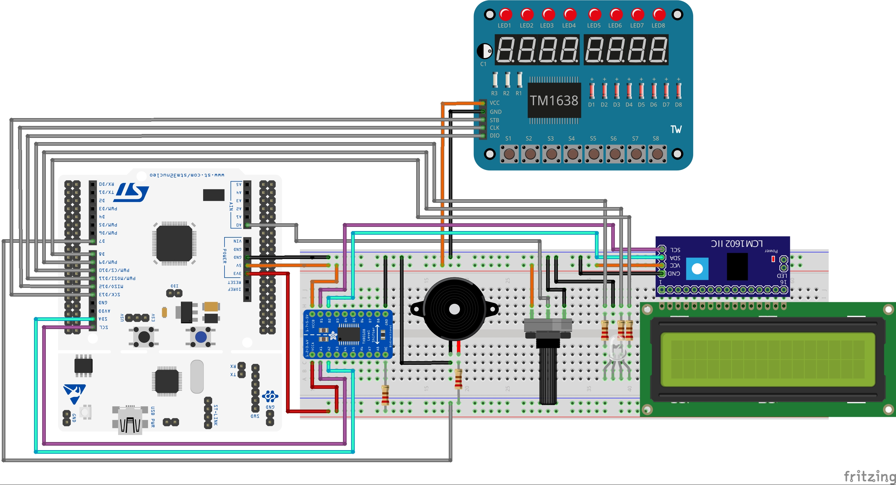

# Arduino Escape Room Game

An interactive and engaging Arduino-based game designed for a physical escape room experience. Players will solve a series of hardware challenges using various components, including potentiometers, LEDs, buttons, and buzzers.

## Overview

The game consists of four challenges, each increasing in complexity:
1. **Potentiometer Lock:** Rotate the potentiometer to find the correct "unlock" position.
2. **Red Light Green Light:** Press the button when the green light is on, within a tight window of time.
3. **Morse Code Challenge:** Decode the Morse code message using the buzzer and perform the instructed actions.
4. **Melody Me:** Listen to a melody played by the buzzer and replicate it using the buttons.

## Hardware Setup



The game is built using an Arduino microcontroller and various components. Refer to the schematic above for the setup.

## Challenges

Each challenge has three levels of difficulty, designed to test the players' speed, memory, and problem-solving skills.

- **Potentiometer Lock:** Increased code length with a randomizing element.
- **Red Light Green Light:** Reduced window for action and increased switching speed of the lights.
- **Morse Code Challenge:** More complex instructions are provided after the initial Morse code is cracked.
- **Melody Me:** A larger number of notes and a faster tempo.

## Usage

Clone the repository and upload the Arduino code to your microcontroller. Ensure all the components are connected as per the schematic.

```
git clone https://github.com/washedszn/escape-room.git
```